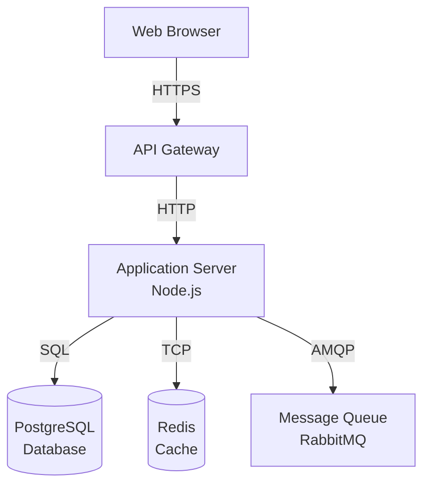
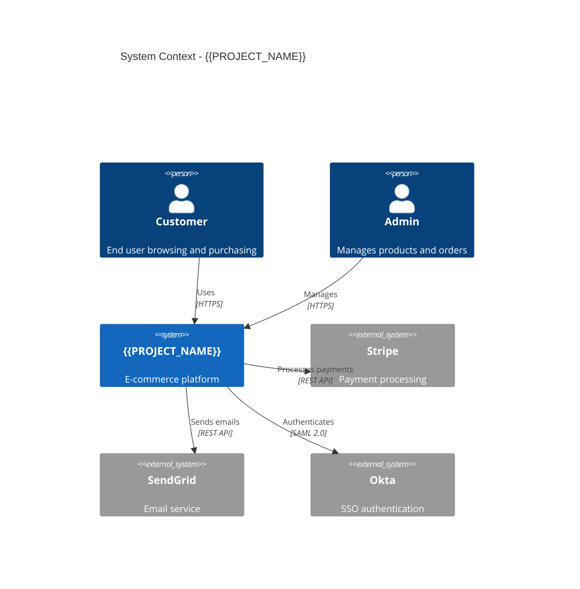
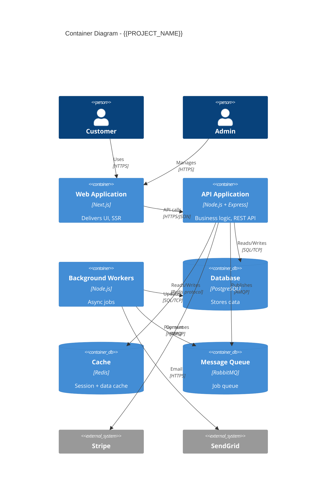
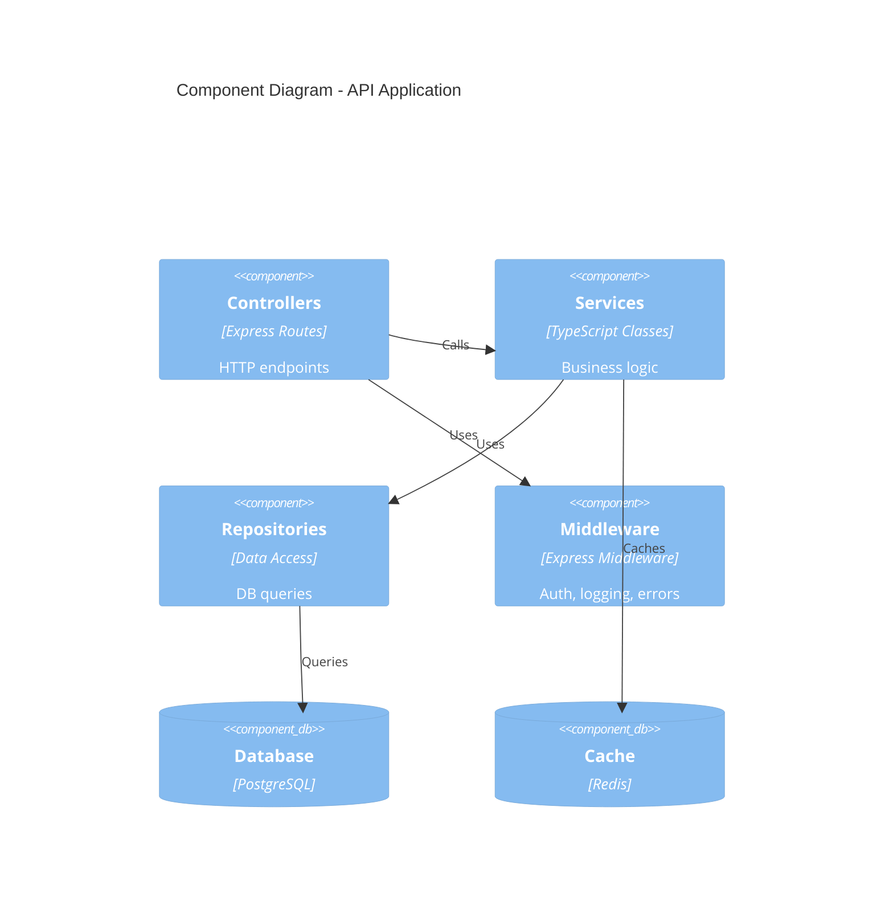
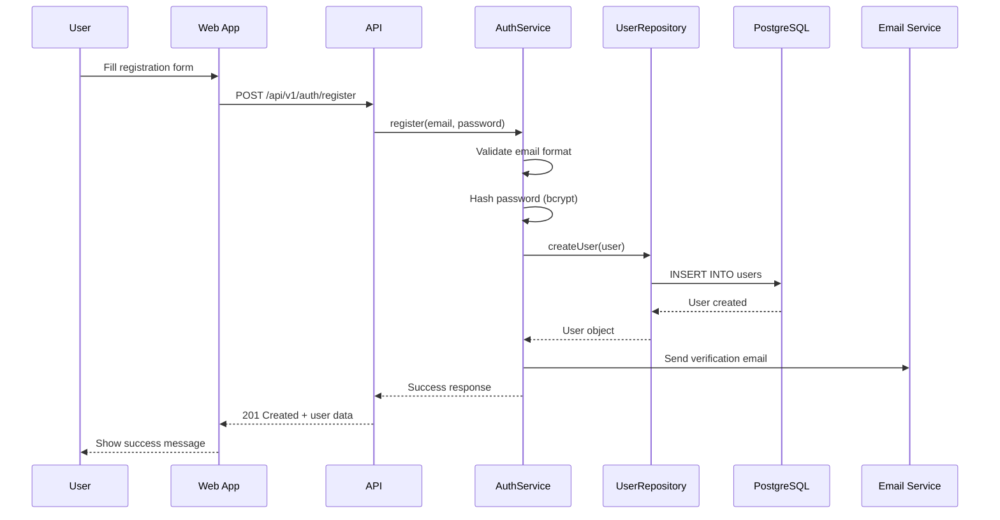
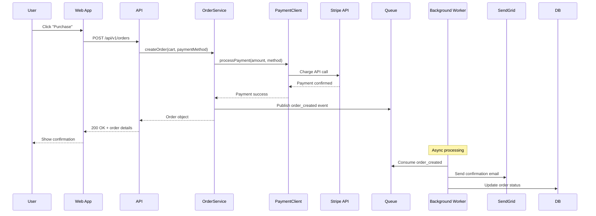
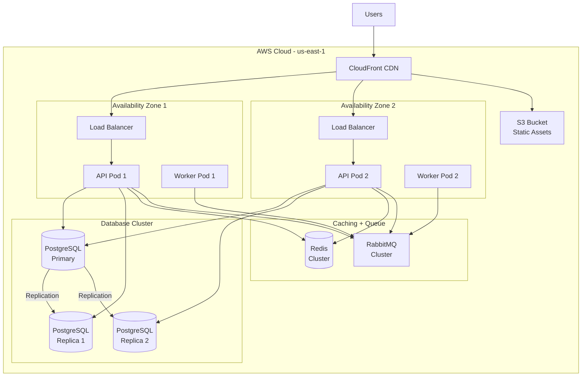

# Software Architecture Document: {{PROJECT_NAME}}

**Document Version:** 1.0
**Date:** {{DATE}}
**Status:** {{STATUS}}
**Architecture Framework:** arc42 (simplified)
**Standard Compliance:** ISO/IEC/IEEE 42010:2022

---

## 1. Introduction and Goals

### 1.1 Requirements Overview
{{REQUIREMENTS_OVERVIEW}}
<!-- Brief summary of key requirements from Requirements Document -->

### 1.2 Quality Goals
{{QUALITY_GOALS}}
<!-- From Q28-Q31: Top 3-5 quality attributes prioritized -->
<!-- Example:
1. **Performance**: 95th percentile <200ms response time (business critical - affects user satisfaction)
2. **Security**: GDPR compliance, AES-256 encryption (regulatory requirement)
3. **Scalability**: Support 1K → 500K users over 3 years (business growth plan)
4. **Reliability**: 99.9% uptime (SLA commitment)
5. **Maintainability**: <5% technical debt ratio (long-term sustainability)
-->

### 1.3 Stakeholders
{{STAKEHOLDERS_SUMMARY}}
<!-- From Q18-Q22, brief summary -->

---

## 2. Constraints

### 2.1 Technical Constraints
{{TECHNICAL_CONSTRAINTS}}
<!-- From Q24, Q26 -->
<!-- Example:
- **Programming Languages**: TypeScript (frontend), Node.js (backend) - team expertise
- **Database**: PostgreSQL 12 - locked until Q2 2025 upgrade
- **Cloud Provider**: AWS - company standard
- **Legacy Integration**: SAP ERP SOAP API (max 10 req/sec) - cannot change
- **Browser Support**: Chrome, Firefox, Safari (last 2 versions) - market requirements
-->

### 2.2 Organizational Constraints
{{ORGANIZATIONAL_CONSTRAINTS}}
<!-- Example:
- **Team Size**: 11 people fixed (no new hires this quarter)
- **Compliance**: GDPR mandatory (EU market)
- **Development Process**: Agile/Scrum, 2-week sprints
-->

### 2.3 Conventions
{{CONVENTIONS}}
<!-- Example:
- **Code Style**: ESLint + Prettier (enforced in CI)
- **Git Workflow**: GitHub Flow (main + feature branches)
- **Naming**: Camel case (variables/functions), Pascal case (classes/components)
- **API Design**: REST

ful, JSON, semantic versioning
- **Testing**: Risk-Based Testing (2-5 E2E, 3-8 Integration, 5-15 Unit, 10-28 total, Priority ≥15)
-->

---

## 3. Context and Scope

### 3.1 Business Context
{{BUSINESS_CONTEXT}}
<!-- High-level view: System + external actors (users, external systems) -->

**Business Context Diagram:**
```mermaid
graph LR
    Customer[Customer]
    Admin[Admin User]
    System[{{PROJECT_NAME}}]
    Payment[Payment Gateway<br/>Stripe]
    Email[Email Service<br/>SendGrid]
    Auth[Auth Provider<br/>Okta]

    Customer -->|Browse, Purchase| System
    Admin -->|Manage Content| System
    System -->|Process Payment| Payment
    System -->|Send Notifications| Email
    System -->|Authenticate| Auth
```

**External Interfaces:**
{{EXTERNAL_INTERFACES}}
<!-- Example table:
| Interface | Type | Protocol | Purpose |
|-----------|------|----------|---------|
| Stripe API | External | HTTPS REST | Payment processing |
| SendGrid API | External | HTTPS REST | Email notifications |
| Okta SSO | External | SAML 2.0 | User authentication |
| SAP ERP | Legacy | SOAP 1.1 | Inventory sync (read-only) |
-->

### 3.2 Technical Context
{{TECHNICAL_CONTEXT}}
<!-- Technical view: System components + technical channels -->

**Technical Context Diagram:**


---

## 4. Solution Strategy

### 4.1 Technology Decisions
{{TECHNOLOGY_DECISIONS}}
<!-- From Q23, Q25, Q26 -->
<!-- Example:
| Decision Area | Technology | Rationale | ADR |
|--------------|------------|-----------|-----|
| Frontend Framework | React 18 + Next.js 14 | SSR for SEO, team expertise | ADR-001 |
| Backend Framework | Node.js + Express | JavaScript fullstack, async I/O | ADR-002 |
| Database | PostgreSQL 15 | ACID, JSON support, mature | ADR-003 |
| Caching | Redis 7 | In-memory speed, pub/sub | ADR-004 |
| API Style | RESTful | Simple, widely understood | ADR-005 |
| Authentication | JWT + OAuth2 | Stateless, standard protocol | ADR-006 |
| Deployment | Docker + Kubernetes | Scalability, cloud-agnostic | ADR-007 |
-->

### 4.2 Top-Level Decomposition
{{TOP_LEVEL_DECOMPOSITION}}
<!-- From Q25 -->
<!-- Example:
**Architecture Pattern**: Layered Architecture (4 layers)
1. **Presentation Layer**: Next.js SSR + React components
2. **API Layer**: Express.js REST endpoints
3. **Business Logic Layer**: Service classes (domain logic)
4. **Data Layer**: Repositories + PostgreSQL + Redis

**Rationale**: Clear separation of concerns, testability, team familiarity
-->

### 4.3 Approach to Quality Goals
{{QUALITY_APPROACH}}
<!-- How architecture achieves quality goals from Section 1.2 -->
<!-- Example:
| Quality Goal | Architectural Approach |
|--------------|----------------------|
| Performance (<200ms) | Redis caching, database indexing, CDN for static assets, async I/O |
| Security (GDPR) | Encryption at rest/transit, OAuth2, RBAC, audit logging, data anonymization |
| Scalability (500K users) | Horizontal scaling (Kubernetes), stateless API, database read replicas |
| Reliability (99.9%) | Multi-AZ deployment, health checks, circuit breakers, automated failover |
| Maintainability (<5% debt) | Layered architecture, dependency injection, 80% code coverage, SonarQube |
-->

---

## 5. Building Block View

### 5.1 Level 1: System Context (C4 Model)
{{SYSTEM_CONTEXT}}
<!-- Highest level: System as black box + external actors -->

**System Context Diagram:**


### 5.2 Level 2: Container Diagram (C4 Model)
{{CONTAINER_DIAGRAM}}
<!-- Containers: Deployable/runnable units (apps, services, databases) -->

**Container Diagram:**


### 5.3 Level 3: Component Diagram (C4 Model)
{{COMPONENT_DIAGRAM}}
<!-- Components: Groupings of related functionality (API layer breakdown) -->

**API Application Components:**


**Key Components:**
{{KEY_COMPONENTS}}
<!-- Example:
| Component | Responsibility | Dependencies |
|-----------|---------------|--------------|
| AuthController | Handle login/register endpoints | AuthService, JWTService |
| AuthService | Validate credentials, generate tokens | UserRepository, PasswordHasher |
| UserRepository | CRUD operations for users table | PostgreSQL |
| ProductService | Product catalog business logic | ProductRepository, CacheService |
| OrderService | Order processing workflow | OrderRepository, PaymentClient, EmailClient |
| PaymentClient | Stripe API integration | Stripe SDK |
-->

---

## 6. Runtime View

### 6.1 Scenario 1: User Registration
{{SCENARIO_USER_REGISTRATION}}

**Sequence Diagram:**


### 6.2 Scenario 2: Product Purchase Flow
{{SCENARIO_PURCHASE_FLOW}}

**Sequence Diagram:**


### 6.3 [Additional Key Scenarios]
{{ADDITIONAL_SCENARIOS}}
<!-- Add 2-3 more critical scenarios with sequence diagrams -->

---

## 7. Deployment View

### 7.1 Infrastructure Overview
{{INFRASTRUCTURE_OVERVIEW}}
<!-- Cloud provider, regions, environments -->
<!-- Example:
- **Cloud Provider**: AWS
- **Regions**: us-east-1 (primary), us-west-2 (DR backup)
- **Environments**: Dev, Staging, Production
- **Orchestration**: Kubernetes (EKS)
-->

### 7.2 Deployment Diagram
{{DEPLOYMENT_DIAGRAM}}

**Deployment Architecture:**


### 7.3 Deployment Mapping
{{DEPLOYMENT_MAPPING}}
<!-- Example table:
| Container | Technology | Instance Type | Scaling | Location |
|-----------|-----------|---------------|---------|----------|
| Web App | Next.js | CloudFront + S3 | Static hosting | Global CDN |
| API | Node.js | ECS Fargate (2 vCPU, 4GB RAM) | Auto-scale 2-20 | Multi-AZ |
| Workers | Node.js | ECS Fargate (1 vCPU, 2GB RAM) | Auto-scale 1-10 | Multi-AZ |
| Database | PostgreSQL 15 | RDS db.r5.large | Primary + 2 replicas | Multi-AZ |
| Cache | Redis 7 | ElastiCache cache.r5.large | 3-node cluster | Multi-AZ |
| Queue | RabbitMQ | EC2 t3.medium | 3-node cluster | Multi-AZ |
-->

---

## 8. Crosscutting Concepts

### 8.1 Security Concept
{{SECURITY_CONCEPT}}
<!-- Example:
- **Authentication**: JWT tokens (1-hour expiration) + refresh tokens (30-day)
- **Authorization**: RBAC with 5 roles (Admin, Editor, Viewer, Guest, API)
- **Encryption**: TLS 1.3 (transit), AES-256 (at rest for PII)
- **API Security**: Rate limiting (100 req/min), API keys for service-to-service
- **Secret Management**: AWS Secrets Manager (production), .env files (development only)
- **Audit Logging**: All write operations logged with user ID + timestamp
-->

### 8.2 Error Handling Concept
{{ERROR_HANDLING_CONCEPT}}
<!-- Example:
- **Custom Exceptions**: Domain-specific errors (PaymentFailedError, UserNotFoundError)
- **Global Exception Handler**: Express middleware catches all errors
- **Error Response Format**: Consistent JSON structure {error: {code, message, details}}
- **Logging**: All errors logged with trace_id, stack trace (Datadog)
- **User-Facing Errors**: Sanitized messages (never expose internal details)
- **Retry Strategy**: Exponential backoff for transient failures (network, rate limits)
-->

### 8.3 Logging and Monitoring Concept
{{LOGGING_MONITORING_CONCEPT}}
<!-- Example:
- **Structured Logging**: JSON format with trace_id, service name, timestamp, level
- **Log Levels**: DEBUG (dev only), INFO (requests), WARNING (slow queries), ERROR (failures)
- **Centralization**: Aggregated in Datadog (cloud), ELK Stack (on-prem alternative)
- **Metrics**: Prometheus + Grafana (latency, throughput, error rate, resource usage)
- **Tracing**: Distributed tracing with OpenTelemetry (trace requests across services)
- **Alerting**: PagerDuty for critical alerts (>5% error rate, p95 latency >500ms)
-->

### 8.4 Testing Concept
{{TESTING_CONCEPT}}
<!-- Example:
- **Test Pyramid**: 70% Unit, 20% Integration, 10% E2E
- **Unit Tests**: Jest + @testing-library/react, mock all external dependencies
- **Integration Tests**: Supertest (API), test DB (PostgreSQL in Docker)
- **E2E Tests**: Playwright, test against staging environment
- **Coverage Target**: ≥80% overall, ≥90% for critical business logic
- **CI/CD**: All tests run on every PR, E2E on merge to main
- **Performance Tests**: k6 load tests (weekly), target 10K req/sec
-->

### 8.5 Configuration Management Concept
{{CONFIG_MANAGEMENT_CONCEPT}}
<!-- Example:
- **Environment Variables**: .env files (dev), AWS Secrets Manager (prod)
- **Config Library**: dotenv (Node.js), validation with Joi schema
- **Environments**: Dev (local), Staging (AWS), Production (AWS)
- **Secrets**: Never committed to Git, rotated quarterly
- **Feature Flags**: LaunchDarkly (or custom Redis-based solution)
-->

---

## 9. Architecture Decisions (ADRs)

{{ADR_LIST}}
<!-- List of all ADRs with links -->
<!-- Example:
| ADR | Title | Status | Date |
|-----|-------|--------|------|
| [ADR-001](../adrs/adr-001-frontend-framework.md) | Use React + Next.js for Frontend | Accepted | 2024-10-15 |
| [ADR-002](../adrs/adr-002-backend-framework.md) | Use Node.js + Express for Backend | Accepted | 2024-10-16 |
| [ADR-003](../adrs/adr-003-database-choice.md) | Use PostgreSQL as Primary Database | Accepted | 2024-10-17 |
| [ADR-004](../adrs/adr-004-caching-strategy.md) | Use Redis for Caching and Sessions | Accepted | 2024-10-18 |
| [ADR-005](../adrs/adr-005-api-style.md) | Use RESTful API Design | Accepted | 2024-10-19 |
-->

**Critical ADRs Summary:**
{{CRITICAL_ADRS_SUMMARY}}
<!-- Brief summary of top 3-5 most impactful decisions -->

---

## 10. Quality Scenarios

{{QUALITY_SCENARIOS}}
<!-- Specific, measurable scenarios for each quality goal -->
<!-- Example:
| ID | Quality Attribute | Scenario | Metric | Priority |
|----|------------------|----------|--------|----------|
| QS-1 | Performance | User searches for "laptop", system returns results | <200ms (p95) | MUST |
| QS-2 | Scalability | Black Friday traffic spike from 1K to 50K concurrent users | No degradation | MUST |
| QS-3 | Security | Attacker attempts SQL injection on login form | Attack blocked, logged | MUST |
| QS-4 | Reliability | Database primary fails | Automated failover <60s | MUST |
| QS-5 | Maintainability | Developer adds new API endpoint | <2 hours (with tests) | SHOULD |
-->

---

## 11. Risks and Technical Debt

### 11.1 Known Technical Risks
{{TECHNICAL_RISKS}}
<!-- From Q32 -->

### 11.2 Technical Debt
{{TECHNICAL_DEBT}}
<!-- Example:
| Debt Item | Impact | Plan | Target Date |
|-----------|--------|------|-------------|
| PostgreSQL 12 (EOL soon) | Security risk | Upgrade to PG 15 | Q2 2025 |
| No database sharding | Scalability limit at 5TB | Implement sharding | Year 2 |
| Monolithic deployment | Slow rollouts | Migrate to microservices | Q3 2025 |
| Manual deployment | Error-prone | Automate with GitOps | Q1 2025 |
-->

### 11.3 Mitigation Strategies
{{MITIGATION_STRATEGIES}}
<!-- From Q34 -->

---

## 12. Glossary

| Term | Definition |
|------|------------|
| {{TERM_1}} | {{DEFINITION_1}} |
| {{TERM_2}} | {{DEFINITION_2}} |
| Container | Deployable/runnable unit (C4 Model), NOT Docker container |
| Component | Grouping of related functionality within a container |
| SSR | Server-Side Rendering |
| RBAC | Role-Based Access Control |
| JWT | JSON Web Token |

---

## 13. References

1. arc42 Architecture Template - https://arc42.org/
2. C4 Model for Visualizing Software Architecture - https://c4model.com/
3. ISO/IEC/IEEE 42010:2022 - Architecture description
4. {{PROJECT_NAME}} Requirements Document
5. {{PROJECT_NAME}} ADRs Directory

---

## Revision History

| Version | Date | Author | Changes |
|---------|------|--------|---------|
| 1.0 | {{DATE}} | {{AUTHOR}} | Initial version |

---

**Version:** 1.0.0
**Template Last Updated:** 2025-10-29
