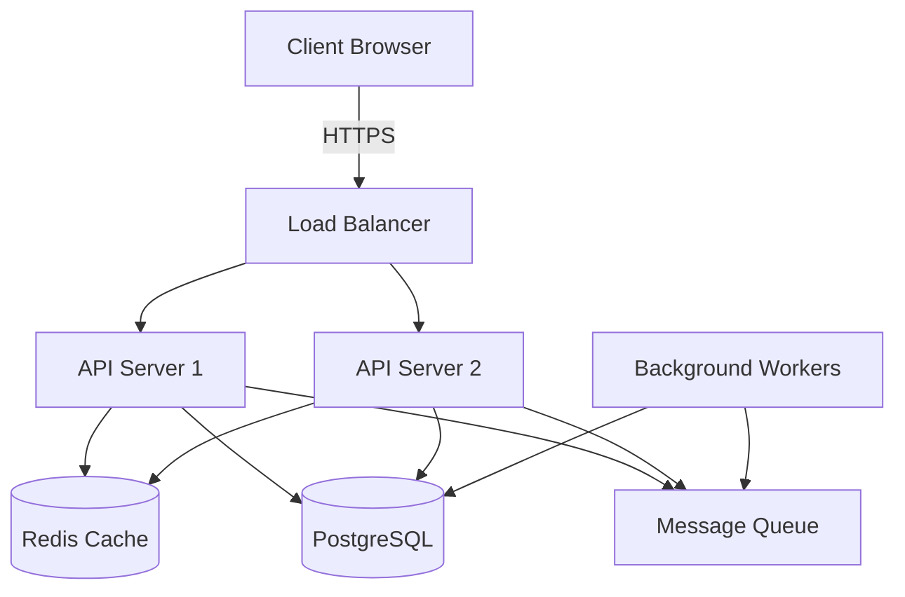
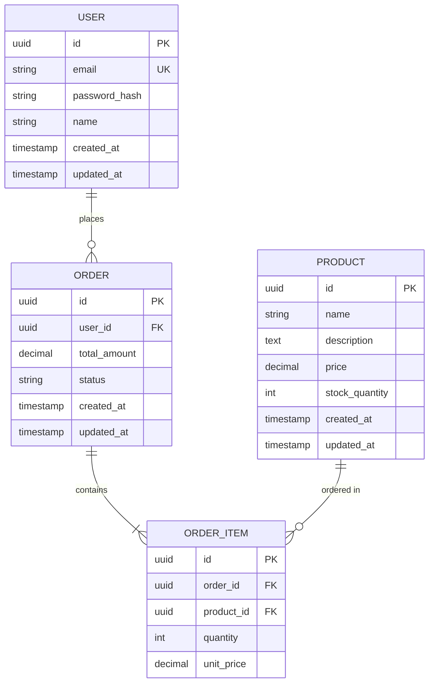

# Technical Specification: {{PROJECT_NAME}}

**Document Version:** 1.0
**Date:** {{DATE}}
**Status:** {{STATUS}}

---

## 1. Introduction

### 1.1 Purpose
This document provides detailed technical specifications for implementing {{PROJECT_NAME}}.

### 1.2 Scope
{{TECHNICAL_SCOPE}}

### 1.3 Intended Audience
- Development Team
- DevOps Engineers
- QA Engineers
- Technical Architects

### 1.4 References
- Architecture Document: {{ARCHITECTURE_DOC_LINK}}
- Requirements Document: {{REQUIREMENTS_DOC_LINK}}
- ADRs: {{ADR_DIRECTORY_LINK}}

---

## 2. Technology Stack

### 2.1 Technology Overview

{{TECHNOLOGY_STACK}}
<!-- From Q23, Q26, ADRs -->

**Technology Stack Table:**

| Layer | Category | Technology | Version | Rationale | ADR |
|-------|----------|----------|---------|-----------|-----|
| **Frontend** | Framework | {{FRONTEND_FRAMEWORK}} | {{VERSION}} | {{RATIONALE}} | ADR-XXX |
| | Language | {{FRONTEND_LANG}} | {{VERSION}} | {{RATIONALE}} | ADR-XXX |
| | Styling | {{STYLING_LIB}} | {{VERSION}} | {{RATIONALE}} | ADR-XXX |
| | State Management | {{STATE_MGMT}} | {{VERSION}} | {{RATIONALE}} | ADR-XXX |
| **Backend** | Framework | {{BACKEND_FRAMEWORK}} | {{VERSION}} | {{RATIONALE}} | ADR-XXX |
| | Language | {{BACKEND_LANG}} | {{VERSION}} | {{RATIONALE}} | ADR-XXX |
| | API Style | {{API_STYLE}} | - | {{RATIONALE}} | ADR-XXX |
| **Database** | Primary | {{PRIMARY_DB}} | {{VERSION}} | {{RATIONALE}} | ADR-XXX |
| | ORM | {{ORM}} | {{VERSION}} | {{RATIONALE}} | ADR-XXX |
| **Caching** | Cache | {{CACHE_TECH}} | {{VERSION}} | {{RATIONALE}} | ADR-XXX |
| **Queue** | Message Queue | {{QUEUE_TECH}} | {{VERSION}} | {{RATIONALE}} | ADR-XXX |
| **Infrastructure** | Container | {{CONTAINER_TECH}} | {{VERSION}} | {{RATIONALE}} | - |
| | Orchestration | {{ORCHESTRATION}} | {{VERSION}} | {{RATIONALE}} | ADR-XXX |
| | Cloud Provider | {{CLOUD_PROVIDER}} | - | {{RATIONALE}} | ADR-XXX |
| **Monitoring** | APM | {{APM_TOOL}} | {{VERSION}} | {{RATIONALE}} | - |
| | Logging | {{LOGGING_TOOL}} | {{VERSION}} | {{RATIONALE}} | - |
| | Metrics | {{METRICS_TOOL}} | {{VERSION}} | {{RATIONALE}} | - |

<!-- Example filled table:
| Layer | Category | Technology | Version | Rationale | ADR |
|-------|----------|----------|---------|-----------|-----|
| Frontend | Framework | Next.js | 14.0 | SSR for SEO, team expertise | ADR-001 |
| Frontend | Language | TypeScript | 5.0 | Type safety, IDE support | ADR-007 |
| Frontend | Styling | Tailwind CSS | 3.4 | Utility-first, rapid development | ADR-010 |
| Backend | Framework | Node.js + Express | 18 LTS | JavaScript fullstack, async I/O | ADR-002 |
| Backend | API Style | RESTful | - | Simplicity, wide adoption | ADR-005 |
| Database | Primary | PostgreSQL | 15 | ACID, JSON support, maturity | ADR-003 |
| Database | ORM | Prisma | 5.0 | Type-safe queries, migrations | ADR-008 |
| Caching | Cache | Redis | 7.0 | In-memory speed, pub/sub | ADR-004 |
| Queue | Message Queue | RabbitMQ | 3.12 | Reliable, supports multiple patterns | ADR-009 |
| Infrastructure | Container | Docker | 24.0 | Consistency across environments | - |
| Infrastructure | Orchestration | Kubernetes (EKS) | 1.28 | Auto-scaling, high availability | ADR-007 |
| Infrastructure | Cloud | AWS | - | Company standard, wide service offering | ADR-006 |
| Monitoring | APM | Datadog | - | Unified observability platform | - |
| Monitoring | Logging | Datadog Logs | - | Centralized logging | - |
| Monitoring | Metrics | Prometheus + Grafana | - | Open-source, self-hosted | - |
-->

### 2.2 Docker Development Environment

**Dockerfile:**

{{DOCKERFILE_DEV}}
<!-- Auto-generated from Q12 (runtime + framework)
Structure:
- Multi-stage: builder (all deps) → runtime (prod deps only)
- Base: Pinned official images (node:20.10-alpine, python:3.11-slim)
- Caching: Copy deps files first, install, copy code last
- Security: Non-root user
-->

**docker-compose.yml (Development):**

{{DOCKER_COMPOSE_DEV}}
<!-- Auto-generated from Q9 + Q11
Services: app (volume: ./src), db, cache, queue (if needed)
Network: app-network
Volumes: Named volumes for data persistence
-->

**docker-compose.test.yml (Testing):**

{{DOCKER_COMPOSE_TEST}}
<!-- Auto-generated from Q9 + Q11
Services: app-test (volumes: ./src, ./tests for hot-reload), db-test (tmpfs, port 5433), cache-test (tmpfs, port 6380)
Network: test-network (isolated)
Command: Test framework with watch mode
-->

---

## 3. System Architecture

### 3.1 Architecture Pattern
{{ARCHITECTURE_PATTERN}}
<!-- From Q25, Architecture Document -->
<!-- Example: Layered Architecture (4 layers: Presentation, API, Business Logic, Data) -->

### 3.2 High-Level Architecture Diagram
<!-- Refer to Architecture Document for detailed diagrams -->
{{HIGH_LEVEL_ARCH_DIAGRAM}}



---

## 4. Database Design

### 4.1 Database Schema

{{DATABASE_SCHEMA}}

**Entity-Relationship Diagram:**



### 4.2 Data Dictionary

{{DATA_DICTIONARY}}

**Table: users**

| Column | Type | Constraints | Description |
|--------|------|-------------|-------------|
| id | UUID | PRIMARY KEY | Unique user identifier |
| email | VARCHAR(255) | NOT NULL, UNIQUE | User email address (used for login) |
| password_hash | VARCHAR(255) | NOT NULL | Bcrypt hashed password |
| name | VARCHAR(100) | NOT NULL | User full name |
| created_at | TIMESTAMP | NOT NULL, DEFAULT NOW() | Account creation timestamp |
| updated_at | TIMESTAMP | NOT NULL, DEFAULT NOW() | Last update timestamp |

**Indexes:**
- `idx_users_email` ON users(email) - For fast login lookups
- `idx_users_created_at` ON users(created_at) - For analytics queries

**Table: orders**

| Column | Type | Constraints | Description |
|--------|------|-------------|-------------|
| id | UUID | PRIMARY KEY | Unique order identifier |
| user_id | UUID | NOT NULL, FOREIGN KEY | Reference to users table |
| total_amount | DECIMAL(10,2) | NOT NULL | Order total in USD |
| status | VARCHAR(20) | NOT NULL, CHECK | Order status (pending, paid, shipped, delivered, canceled) |
| created_at | TIMESTAMP | NOT NULL, DEFAULT NOW() | Order creation timestamp |
| updated_at | TIMESTAMP | NOT NULL, DEFAULT NOW() | Last update timestamp |

**Indexes:**
- `idx_orders_user_id` ON orders(user_id) - For user order history
- `idx_orders_status` ON orders(status) - For admin filtering
- `idx_orders_created_at` ON orders(created_at DESC) - For recent orders

<!-- Repeat for all tables -->

### 4.3 Database Migrations

**Migration Strategy:**
{{MIGRATION_STRATEGY}}
<!-- Example: Prisma migrations, versioned in Git, automated in CI/CD -->

**Migration Tool:** {{MIGRATION_TOOL}}
<!-- Example: Alembic (Python), Prisma Migrate, Flyway (Java) -->

---

## 5. API Specifications

### 5.1 API Design Principles

{{API_DESIGN_PRINCIPLES}}
<!-- Example:
- RESTful conventions (nouns for resources, HTTP verbs for actions)
- JSON request/response format
- Semantic versioning in URL (/v1/, /v2/)
- Consistent error response format
- HATEOAS links for discoverability (optional)
-->

### 5.2 API Endpoints

{{API_ENDPOINTS}}

**Authentication Endpoints:**

| Method | Endpoint | Description | Auth Required | Request Body | Response |
|--------|----------|-------------|---------------|--------------|----------|
| POST | /api/v1/auth/register | Register new user | No | {email, password, name} | 201: {user, token} |
| POST | /api/v1/auth/login | User login | No | {email, password} | 200: {user, token} |
| POST | /api/v1/auth/refresh | Refresh JWT token | Yes | {refreshToken} | 200: {token} |
| POST | /api/v1/auth/logout | User logout | Yes | - | 204: No Content |

**User Endpoints:**

| Method | Endpoint | Description | Auth Required | Request Body | Response |
|--------|----------|-------------|---------------|--------------|----------|
| GET | /api/v1/users/me | Get current user profile | Yes | - | 200: {user} |
| PUT | /api/v1/users/me | Update user profile | Yes | {name, email} | 200: {user} |
| DELETE | /api/v1/users/me | Delete user account | Yes | - | 204: No Content |

**Product Endpoints:**

| Method | Endpoint | Description | Auth Required | Request Body | Response |
|--------|----------|-------------|---------------|--------------|----------|
| GET | /api/v1/products | List products | No | Query: page, limit, search | 200: {products[], total} |
| GET | /api/v1/products/:id | Get product by ID | No | - | 200: {product} |
| POST | /api/v1/products | Create product | Yes (Admin) | {name, description, price, stock} | 201: {product} |
| PUT | /api/v1/products/:id | Update product | Yes (Admin) | {name, description, price, stock} | 200: {product} |
| DELETE | /api/v1/products/:id | Delete product | Yes (Admin) | - | 204: No Content |

<!-- Continue for all endpoint groups -->

### 5.3 API Request/Response Examples

**Example: POST /api/v1/auth/register**

Request:
```json
{
  "email": "user@example.com",
  "password": "SecurePass123!",
  "name": "John Doe"
}
```

Response (201 Created):
```json
{
  "user": {
    "id": "550e8400-e29b-41d4-a716-446655440000",
    "email": "user@example.com",
    "name": "John Doe",
    "createdAt": "2024-10-29T10:30:00Z"
  },
  "token": "eyJhbGciOiJIUzI1NiIsInR5cCI6IkpXVCJ9...",
  "refreshToken": "eyJhbGciOiJIUzI1NiIsInR5cCI6IkpXVCJ9..."
}
```

Error Response (400 Bad Request):
```json
{
  "error": {
    "code": "VALIDATION_ERROR",
    "message": "Invalid request data",
    "details": [
      {
        "field": "email",
        "message": "Email already exists"
      }
    ]
  }
}
```

### 5.4 API Authentication

{{API_AUTHENTICATION}}
<!-- Example:
- **Method**: JWT (JSON Web Tokens)
- **Token Type**: Bearer token in Authorization header
- **Token Expiration**: 1 hour (access token), 30 days (refresh token)
- **Header Format**: `Authorization: Bearer <token>`
- **Token Payload**: {userId, email, roles, exp, iat}
- **Refresh Mechanism**: POST /api/v1/auth/refresh with refreshToken
-->

### 5.5 API Error Codes

{{API_ERROR_CODES}}

| HTTP Status | Error Code | Description | Example Scenario |
|-------------|-----------|-------------|------------------|
| 400 | VALIDATION_ERROR | Invalid request data | Missing required field |
| 401 | UNAUTHORIZED | Authentication required | No token provided |
| 403 | FORBIDDEN | Insufficient permissions | Non-admin accessing admin endpoint |
| 404 | NOT_FOUND | Resource not found | Product ID doesn't exist |
| 409 | CONFLICT | Resource conflict | Email already registered |
| 429 | RATE_LIMIT_EXCEEDED | Too many requests | >100 requests/min |
| 500 | INTERNAL_SERVER_ERROR | Server error | Database connection failed |
| 503 | SERVICE_UNAVAILABLE | Service temporarily unavailable | Maintenance mode |

---

## 6. External Integrations

### 6.1 Integration Overview

{{INTEGRATION_OVERVIEW}}
<!-- From Q27 -->

| Integration | Purpose | Protocol | Auth Method | Rate Limits | SLA |
|-------------|---------|----------|-------------|-------------|-----|
| {{INTEGRATION_1}} | {{PURPOSE}} | {{PROTOCOL}} | {{AUTH}} | {{LIMITS}} | {{SLA}} |

<!-- Example:
| Integration | Purpose | Protocol | Auth Method | Rate Limits | SLA |
|-------------|---------|----------|-------------|-------------|-----|
| Stripe API | Payment processing | HTTPS REST | API Key (Secret) | 100 req/sec | 99.99% uptime |
| SendGrid API | Email notifications | HTTPS REST | API Key | 600 emails/min | 99.9% uptime |
| Okta SSO | User authentication | SAML 2.0 | Certificate-based | N/A | 99.99% uptime |
| SAP ERP (Legacy) | Inventory sync | SOAP 1.1 | Basic Auth | 10 req/sec | 95% uptime |
-->

### 6.2 Integration Details

**{{INTEGRATION_1_NAME}}:**
- **Endpoint**: {{ENDPOINT}}
- **Documentation**: {{DOCS_URL}}
- **Authentication**: {{AUTH_DETAILS}}
- **Error Handling**: {{ERROR_HANDLING}}
- **Retry Strategy**: {{RETRY_STRATEGY}}
- **Timeout**: {{TIMEOUT}}
- **Circuit Breaker**: {{CIRCUIT_BREAKER_CONFIG}}

<!-- Example for Stripe:
**Stripe Payment API:**
- **Endpoint**: https://api.stripe.com/v1
- **Documentation**: https://stripe.com/docs/api
- **Authentication**: Secret API Key in header: `Authorization: Bearer sk_...`
- **Error Handling**: Catch `StripeError`, map to domain exceptions
- **Retry Strategy**: Exponential backoff (1s, 2s, 4s) for 5xx errors
- **Timeout**: 30 seconds
- **Circuit Breaker**: Open after 3 failures, half-open after 60s
-->

---

## 7. Security Implementation

### 7.1 Authentication Implementation

{{AUTH_IMPLEMENTATION}}
<!-- From NFR-SEC-001, Q29 -->
<!-- Example:
- **JWT Generation**: Sign with RS256 algorithm, 1-hour expiration
- **Password Hashing**: Bcrypt with salt rounds=12
- **Token Storage**: HttpOnly cookies (web), secure storage (mobile)
- **Session Management**: Refresh tokens in database (revocable)
- **OAuth2 Flow**: Authorization Code Flow for third-party providers
-->

### 7.2 Authorization Implementation

{{AUTHZ_IMPLEMENTATION}}
<!-- Example:
- **RBAC Model**: 5 roles (Admin, Editor, Viewer, Guest, API)
- **Permission Checking**: Middleware validates user roles
- **Resource Ownership**: Users can only access their own resources (except Admins)
- **API Keys**: Service-to-service authentication (stored in AWS Secrets Manager)
-->

### 7.3 Data Encryption

{{ENCRYPTION_IMPLEMENTATION}}
<!-- From NFR-SEC-002 -->
<!-- Example:
- **In Transit**: TLS 1.3, HTTPS only (HSTS header with 1-year max-age)
- **At Rest**: AES-256 encryption for PII fields (email, name, address)
- **Database**: PostgreSQL pgcrypto extension for sensitive columns
- **Backups**: Encrypted backups (AWS S3 server-side encryption)
- **Key Management**: AWS KMS for encryption key rotation
-->

### 7.4 Security Headers

{{SECURITY_HEADERS}}
<!-- Example:
- `Strict-Transport-Security: max-age=31536000; includeSubDomains`
- `Content-Security-Policy: default-src 'self'; script-src 'self' 'unsafe-inline'`
- `X-Frame-Options: DENY`
- `X-Content-Type-Options: nosniff`
- `Referrer-Policy: strict-origin-when-cross-origin`
-->

---

## 8. Performance Optimization

### 8.1 Caching Strategy

{{CACHING_STRATEGY}}
<!-- Example:
- **API Response Caching**: Redis, TTL=5min for GET endpoints
- **Database Query Caching**: Redis, TTL=1hour for slow queries (reports)
- **CDN Caching**: CloudFront for static assets, TTL=1 year (versioned URLs)
- **Browser Caching**: Cache-Control headers for images (1 week)
- **Cache Invalidation**: Event-driven (update → invalidate cache)
-->

### 8.2 Database Optimization

{{DB_OPTIMIZATION}}
<!-- Example:
- **Indexes**: All foreign keys indexed, composite indexes for common queries
- **Connection Pooling**: PgBouncer (max 100 connections)
- **Read Replicas**: 2 replicas for read-heavy queries
- **Query Optimization**: EXPLAIN ANALYZE for all slow queries (>100ms)
- **Partitioning**: orders table partitioned by created_at (monthly partitions)
-->

### 8.3 Asset Optimization

{{ASSET_OPTIMIZATION}}
<!-- Example:
- **Image Optimization**: WebP format, lazy loading, responsive images
- **Code Splitting**: Dynamic imports, route-based splitting
- **Tree Shaking**: Remove unused code from bundles
- **Minification**: JavaScript/CSS minified in production
- **Compression**: Gzip/Brotli for text assets
-->

---

## 9. Testing Strategy

### 9.1 Risk-Based Testing

{{RISK_BASED_TESTING}}
<!-- Example:
- **E2E Tests (2-5)**: Playwright, test Priority ≥15 user flows (login, checkout, critical paths)
- **Integration Tests (3-8)**: Supertest (API), PostgreSQL in Docker, test Priority ≥15 interactions
- **Unit Tests (5-15)**: Jest + @testing-library/react, test Priority ≥15 complex business logic
- **Test Limits**: 10-28 total tests per Story (enforced)
- **Skip**: Simple CRUD, framework code, trivial conditionals, getters/setters
-->

### 9.2 Test Environments

{{TEST_ENVIRONMENTS}}
<!-- Example:
- **Development**: Local (Docker Compose), mock external APIs
- **Staging**: AWS (mirrors production), real external APIs (test mode)
- **Production**: AWS (live), real external APIs
-->

### 9.3 CI/CD Testing

{{CICD_TESTING}}
<!-- Example:
- **PR Checks**: Unit + Integration tests, linting, type checking
- **Main Branch**: All tests + E2E tests
- **Nightly**: Load tests (k6), security scans (Snyk)
- **Pre-Release**: Full regression suite, performance benchmarks
-->

---

## 10. Deployment

### 10.1 Deployment Strategy

{{DEPLOYMENT_STRATEGY}}
<!-- Example:
- **Strategy**: Blue-Green Deployment (zero downtime)
- **Rollback**: Automated rollback on health check failures
- **Database Migrations**: Run before deployment (backward-compatible)
- **Feature Flags**: LaunchDarkly for gradual rollouts
-->

### 10.2 Infrastructure as Code

{{IAC}}
<!-- Example:
- **Tool**: Terraform (AWS resources), Helm Charts (Kubernetes)
- **Repository**: infra/ directory in main repo
- **Environments**: Separate Terraform workspaces (dev, staging, prod)
- **State Management**: Terraform Cloud (remote state, locking)
-->

### 10.3 Monitoring and Alerting

{{MONITORING_ALERTING}}
<!-- Example:
- **APM**: Datadog (latency, throughput, error rate)
- **Logs**: Centralized in Datadog Logs (structured JSON)
- **Metrics**: Prometheus + Grafana (system metrics, custom metrics)
- **Alerts**: PagerDuty for critical alerts (>5% error rate, p95 latency >500ms)
- **On-Call**: Rotation schedule, runbooks for common incidents
-->

---

## 11. Development Environment Setup

### 11.1 Prerequisites

{{DEV_PREREQUISITES}}
<!-- Example:
- Node.js 18+ (LTS)
- Docker Desktop 4.0+
- Git 2.30+
- IDE: VS Code with extensions (ESLint, Prettier, TypeScript)
-->

### 11.2 Local Setup

{{LOCAL_SETUP}}
<!-- Example:
1. Clone repository: `git clone <repo-url>`
2. Install dependencies: `npm install`
3. Copy environment: `cp .env.example .env`
4. Start services: `docker-compose up -d`
5. Run migrations: `npm run migrate`
6. Seed database: `npm run seed`
7. Start dev server: `npm run dev`
8. Access: http://localhost:3000
-->

### 11.3 Development Workflow

{{DEV_WORKFLOW}}
<!-- Example:
1. Create feature branch: `git checkout -b feature/xyz`
2. Develop feature (TDD: test first, then implementation)
3. Run tests: `npm test`
4. Commit changes: `git commit -m "feat: add xyz"`
5. Push branch: `git push origin feature/xyz`
6. Create PR on GitHub
7. Wait for CI checks to pass
8. Request code review (2 approvers required)
9. Merge to main (squash and merge)
-->

---

## 12. Appendices

### Appendix A: Code Style Guide

{{CODE_STYLE_GUIDE}}
<!-- Link to detailed code style guide or inline summary -->

### Appendix B: Naming Conventions

{{NAMING_CONVENTIONS}}
<!-- Example:
- **Variables**: camelCase (userId, productName)
- **Functions**: camelCase (getUserById, calculateTotal)
- **Classes**: PascalCase (UserService, ProductRepository)
- **Constants**: UPPER_SNAKE_CASE (MAX_RETRIES, API_BASE_URL)
- **Files**: kebab-case (user-service.ts, product-repository.ts)
- **Database Tables**: snake_case plural (users, orders, order_items)
- **Database Columns**: snake_case (user_id, created_at)
-->

### Appendix C: Glossary

| Term | Definition |
|------|------------|
| {{TERM}} | {{DEFINITION}} |

---

## Revision History

| Version | Date | Author | Changes |
|---------|------|--------|---------|
| 1.0 | {{DATE}} | {{AUTHOR}} | Initial version |

---

**Version:** 1.0.0
**Template Last Updated:** 2025-10-29
