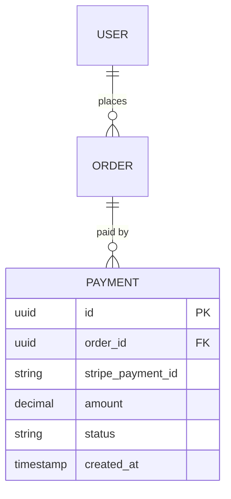

# Documentation Update Strategies

This reference provides detailed mappings from code changes to documentation sections, guiding the project-documentation-updater skill on which sections to update for each type of change.

---

## Change Type Mapping Table

| Change Type | Detection Pattern | Affected Document | Section | Update Strategy | Example |
|-------------|-------------------|-------------------|---------|-----------------|---------|
| **New Dependency** | package.json, requirements.txt, go.mod, pom.xml, Gemfile | architecture.md | 4.1 Technology Decisions | Add row to technology table | Added stripe v10.0.0 |
| | | technical_specification.md | 2.1 Technology Stack | Add row to stack table | Add Stripe SDK row |
| **Removed Dependency** | package.json (deleted entry) | architecture.md | 4.1 Technology Decisions | Mark as deprecated or remove | Removed lodash (no longer needed) |
| | | technical_specification.md | 2.1 Technology Stack | Remove row from table | Remove lodash row |
| **Dependency Version Update** | package.json (version change) | technical_specification.md | 2.1 Technology Stack | Update version in table | react 18.0.0 → 18.2.0 |
| **New API Endpoint** | */routes/*, */controllers/*, */api/* | technical_specification.md | 5.2 API Endpoints | Add endpoint row to table | POST /api/v1/payments |
| | | architecture.md | 6 Runtime View | Add sequence diagram (if major) | Payment flow scenario |
| **Modified API Endpoint** | */routes/* (modified file) | technical_specification.md | 5.2 API Endpoints | Update endpoint description | Changed /users/:id auth |
| **Deleted API Endpoint** | */routes/* (deleted) | technical_specification.md | 5.2 API Endpoints | Remove endpoint row | Removed deprecated endpoint |
| **New Database Table** | */migrations/*, */models/*, */schema/* | technical_specification.md | 4.1 Database Schema | Update ER diagram + add entity | payments table added |
| | | technical_specification.md | 4.2 Data Dictionary | Add table documentation | Document payments columns |
| **Modified Database Table** | */migrations/* (ALTER TABLE) | technical_specification.md | 4.1 Database Schema | Update ER diagram if relationships changed | Added user_id foreign key |
| | | technical_specification.md | 4.2 Data Dictionary | Update column list | Added created_at column |
| **New Service/Module** | New directory in src/, services/, lib/ | architecture.md | 5.2 Container Diagram | Add container (if microservice) | PaymentService container |
| | | architecture.md | 5.3 Component Diagram | Add component (if module) | PaymentController component |
| | | technical_specification.md | 3.2 High-Level Arch Diagram | Update system diagram | Add payment service box |
| **Docker Configuration** | Dockerfile, docker-compose.yml | technical_specification.md | 2.2 Docker Environment | Update Dockerfile/compose code blocks | Added stripe-cli service |
| | | architecture.md | 7.2 Deployment Diagram | Update if new service added | Add stripe-cli to deployment |
| **Environment Variables** | .env.example | technical_specification.md | 8.5 Configuration Management | Add new variables to list | Added STRIPE_SECRET_KEY |
| **External Integration** | New API client, SDK usage | technical_specification.md | 6.1 Integration Overview | Add integration row to table | Stripe API integration |
| | | technical_specification.md | 6.2 Integration Details | Add detailed integration section | Stripe auth, endpoints, retry |
| | | adrs/ | New ADR | Create ADR for integration choice | ADR-006: Use Stripe |
| **Breaking Architecture Change** | Major refactor, new pattern | architecture.md | Multiple sections | Update affected sections | Monolith → microservices |
| | | adrs/ | New ADR | Document decision and rationale | ADR-007: Migrate to microservices |
| **New Security Feature** | Auth changes, encryption | technical_specification.md | 7 Security Implementation | Update security sections | Added JWT refresh tokens |
| | | requirements.md | 4.2 Security Requirements | Add NFR-SEC-NNN requirement | NFR-SEC-005: Token refresh |
| **New Test Suite** | */tests/* (new directory) | technical_specification.md | 9.1 Risk-Based Testing | Update test stats | E2E tests added (2-5 total) |
| **Performance Change** | Caching, optimization | technical_specification.md | 8 Performance Optimization | Update caching/optimization section | Added Redis caching |
| | | requirements.md | 4.1 Performance Requirements | Update if targets changed | p95 latency <200ms → <100ms |

---

## Section-Specific Update Strategies

### 1. Requirements.md Updates

#### Section 3: Functional Requirements
**When to Update**: New features, API endpoints, user-facing functionality

**Update Strategy**:
1. Identify feature group (User Management, Product Catalog, etc.)
2. Find highest FR-XXX-NNN number in that group
3. Add new requirement with next sequential number
4. Follow format:
   ```markdown
   #### FR-XXX-NNN: Requirement Title
   **Description**: [What the system shall do]
   **Priority**: MUST/SHOULD/COULD (MoSCoW)
   **Acceptance Criteria**:
   - [Criterion 1]
   - [Criterion 2]
   ```
5. Use Edit tool to insert after last requirement in group

**Example**:
```markdown
OLD:
#### FR-PAY-001: Display Payment Methods
...

NEW (added):
#### FR-PAY-002: Process Credit Card Payments
**Description**: System shall process credit card payments via Stripe
**Priority**: MUST
**Acceptance Criteria**:
- Accept Visa, MasterCard, Amex
- Validate card details before submission
- Return payment confirmation within 5 seconds
```

#### Section 4: Non-Functional Requirements
**When to Update**: Performance/security/scalability changes

**Update Strategy**:
1. Identify NFR category (Performance, Security, Scalability, etc.)
2. Find highest NFR-CAT-NNN number in that category
3. Add new requirement with next sequential number
4. Follow existing format in that category

---

### 2. Architecture.md Updates

#### Section 4.1: Technology Decisions
**When to Update**: New dependencies, technology choices

**Update Strategy**:
1. Locate technology decisions table (starts with `| Decision Area | Technology | Rationale | ADR |`)
2. Add new row at end of table
3. Reference ADR number (create ADR if significant decision)

**Example**:
```markdown
| Decision Area | Technology | Rationale | ADR |
|--------------|------------|-----------|-----|
| Payment Gateway | Stripe API v10.0.0 | Industry standard, excellent docs, PCI compliance | ADR-006 |
```

#### Section 5.2: Container Diagram (C4 Model)
**When to Update**: New services, containers, databases

**Update Strategy**:
1. Read existing Mermaid diagram (between \`\`\`mermaid and \`\`\`)
2. Add new Container or ContainerDb nodes
3. Add Rel (relationship) connections
4. Regenerate entire diagram block with additions

**Example**:
```mermaid
Container(payment, "Payment Service", "Node.js", "Handles payment processing")
ContainerDb(stripe, "Stripe API", "External", "Payment gateway")

Rel(api, payment, "Calls", "HTTPS")
Rel(payment, stripe, "Processes", "HTTPS")
```

#### Section 5.3: Component Diagram (C4 Model)
**When to Update**: New controllers, services, repositories

**Update Strategy**:
1. Read existing component diagram
2. Add new Component nodes for new modules
3. Add Rel connections to existing components
4. Regenerate entire diagram block

**Example**:
```mermaid
Component(paymentController, "PaymentController", "Express Route", "Payment endpoints")
Component(paymentService, "PaymentService", "Business Logic", "Payment processing")
Component(stripeClient, "StripeClient", "Integration", "Stripe API wrapper")

Rel(paymentController, paymentService, "Calls")
Rel(paymentService, stripeClient, "Uses")
Rel(stripeClient, stripe, "API Calls")
```

---

### 3. Technical_specification.md Updates

#### Section 2.1: Technology Stack
**When to Update**: Any dependency change

**Update Strategy**:
1. Locate technology stack table
2. Find appropriate Layer row (Frontend, Backend, Database, etc.)
3. Add new row or update existing row
4. Include: Layer, Category, Technology, Version, Rationale, ADR link

**Example**:
```markdown
| Layer | Category | Technology | Version | Rationale | ADR |
|-------|----------|----------|---------|-----------|-----|
| Backend | Payment Gateway | Stripe SDK | 10.0.0 | Industry standard, PCI compliant | ADR-006 |
```

#### Section 2.2: Docker Development Environment
**When to Update**: Dockerfile or docker-compose.yml changes

**Update Strategy**:
1. Read updated Dockerfile or docker-compose.yml from project root
2. Use Edit tool to replace entire code block in Section 2.2
3. Preserve markdown code fence formatting (\`\`\`yaml or \`\`\`dockerfile)

#### Section 4.1: Database Schema (ER Diagram)
**When to Update**: New tables, columns, relationships

**Update Strategy**:
1. Read existing ER diagram (Mermaid erDiagram syntax)
2. Add new entity blocks for new tables
3. Add relationships using ||--o{ syntax
4. Regenerate entire diagram block

**Example**:


#### Section 4.2: Data Dictionary
**When to Update**: New tables added

**Update Strategy**:
1. Find last table documentation in Section 4.2
2. Add new table header: `**Table: table_name**`
3. Add table with columns: Column, Type, Constraints, Description
4. Add **Indexes** subsection below table

**Example**:
```markdown
**Table: payments**

| Column | Type | Constraints | Description |
|--------|------|-------------|-------------|
| id | UUID | PRIMARY KEY | Unique payment identifier |
| order_id | UUID | FOREIGN KEY, NOT NULL | Reference to orders table |
| stripe_payment_id | VARCHAR(255) | UNIQUE, NOT NULL | Stripe payment intent ID |
| amount | DECIMAL(10,2) | NOT NULL | Payment amount in USD |
| status | VARCHAR(20) | NOT NULL, CHECK | Payment status (pending, succeeded, failed) |
| created_at | TIMESTAMP | NOT NULL, DEFAULT NOW() | Payment timestamp |

**Indexes:**
- `idx_payments_order_id` ON payments(order_id) - For order lookup
- `idx_payments_stripe_id` ON payments(stripe_payment_id) - For Stripe webhook processing
- `idx_payments_status` ON payments(status) - For filtering by status
```

#### Section 5.2: API Endpoints
**When to Update**: New/modified/deleted API endpoints

**Update Strategy**:
1. Locate endpoint group table (Authentication, User, Product, etc.)
2. Add new row at end of group
3. Follow format: Method, Endpoint, Description, Auth Required, Request Body, Response

**Example**:
```markdown
**Payment Endpoints:**

| Method | Endpoint | Description | Auth Required | Request Body | Response |
|--------|----------|-------------|---------------|--------------|----------|
| POST | /api/v1/payments | Process payment | Yes | {orderId, paymentMethod, amount} | 201: {payment} |
| GET | /api/v1/payments/:id | Get payment status | Yes | - | 200: {payment} |
```

#### Section 6.1: Integration Overview
**When to Update**: New external integrations

**Update Strategy**:
1. Locate integration overview table
2. Add new row with: Integration, Purpose, Protocol, Auth Method, Rate Limits, SLA

**Example**:
```markdown
| Integration | Purpose | Protocol | Auth Method | Rate Limits | SLA |
|-------------|---------|----------|-------------|-------------|-----|
| Stripe API | Payment processing | HTTPS REST | API Key (Secret) | 100 req/sec | 99.99% uptime |
```

#### Section 6.2: Integration Details
**When to Update**: New external integrations

**Update Strategy**:
1. Find last integration details section
2. Add new subsection with integration name
3. Document: Endpoint, Documentation, Authentication, Error Handling, Retry Strategy, Timeout, Circuit Breaker

**Example**:
```markdown
**Stripe Payment API:**
- **Endpoint**: https://api.stripe.com/v1
- **Documentation**: https://stripe.com/docs/api
- **Authentication**: Secret API Key in header: `Authorization: Bearer sk_...`
- **Error Handling**: Catch `StripeError`, map to domain exceptions
- **Retry Strategy**: Exponential backoff (1s, 2s, 4s) for 5xx errors
- **Timeout**: 30 seconds
- **Circuit Breaker**: Open after 3 failures, half-open after 60s
```

---

### 4. ADRs (Architecture Decision Records)

#### When to Create New ADR
**Trigger Conditions**:
- New architectural pattern introduced (microservices, event-driven, etc.)
- Significant technology choice (database, framework, cloud provider)
- Breaking change requiring refactor
- New external integration (payment gateway, auth provider)
- Security architecture change (authentication method, encryption)

**Update Strategy**:
1. Find highest ADR number in `docs/project/adrs/` directory
2. Copy `_template.md` → `adr-NNN-title.md` (NNN = max + 1, zero-padded)
3. Fill sections using Edit tool:
   - **Context**: Problem, constraints, forces
   - **Decision**: Chosen solution with implementation details
   - **Rationale**: Why this decision (numbered list)
   - **Consequences**: Positive and negative impacts
   - **Alternatives Considered**: 2-3 alternatives with pros/cons/rejection reason
   - **Related Decisions**: Link to related ADRs
4. Update architecture.md Section 9 (ADR List) with new ADR link

**ADR Numbering**:
- Find max: `ls docs/project/adrs/ | grep -E '^adr-[0-9]+' | sort -V | tail -1`
- Extract number: `adr-005-...` → 5
- New ADR: `adr-006-...`

**Example ADR Title Formats**:
- `adr-001-use-react-nextjs-frontend.md`
- `adr-006-use-stripe-payment-processing.md`
- `adr-010-migrate-to-microservices-architecture.md`

---

## Diagram Regeneration Guidelines

### Mermaid Diagrams
**When to Regenerate**: Structure changed (new entities, relationships, components)

**C4 Context Diagram**:
- Regenerate if: New external systems added (Stripe, SendGrid, etc.)
- Keep existing: Internal system, user personas

**C4 Container Diagram**:
- Regenerate if: New services, databases, or containers added
- Update: Relationships (Rel) between containers

**C4 Component Diagram**:
- Regenerate if: New controllers, services, or repositories added
- Update: Component relationships

**ER Diagram**:
- Regenerate if: New tables or relationships added
- Keep existing: All existing tables (do not remove unless deleted)

**Deployment Diagram**:
- Regenerate if: New infrastructure components (servers, databases, services)
- Update: Deployment topology

### Diagram Update Process:
1. Read existing diagram (between \`\`\`mermaid and \`\`\`)
2. Parse structure (nodes, relationships)
3. Add new nodes/relationships
4. Regenerate entire diagram block (DO NOT partial edit Mermaid syntax)
5. Validate syntax before injecting

---

## Ambiguity Detection Rules

**Flag for User Clarification** when:

1. **Unclear Service Type**:
   - New directory in `services/` detected
   - Question: "Is this a microservice, module, or library?"

2. **Unclear Database Purpose**:
   - New table detected but name is generic (e.g., `data`, `items`)
   - Question: "What entities does this table represent?"

3. **Unclear Integration Scope**:
   - New external API client detected
   - Question: "What features use this integration? What data is exchanged?"

4. **Unclear Breaking Change**:
   - Major file refactor detected (>50% lines changed)
   - Question: "Is this a breaking change? What architectural pattern changed?"

5. **Unclear Configuration Purpose**:
   - New environment variable in `.env.example`
   - Question: "What is this configuration used for?"

**Do NOT Flag** for:
- Minor version bumps (1.0.0 → 1.0.1)
- Code refactors within same module
- Test file changes
- Documentation-only changes

---

## Update Frequency Recommendations

**Immediate Updates** (after every significant change):
- New external integration
- Breaking API changes
- Database schema migrations
- Major architectural refactors

**Batch Updates** (weekly or sprint-end):
- Minor dependency updates
- New API endpoints (non-breaking)
- Configuration changes
- Test suite additions

**Milestone Updates** (before releases):
- Complete documentation review
- All ADRs finalized
- HTML presentation rebuilt
- Traceability matrix updated

---

**Version:** 1.0.0
**Last Updated:** 2025-01-30
